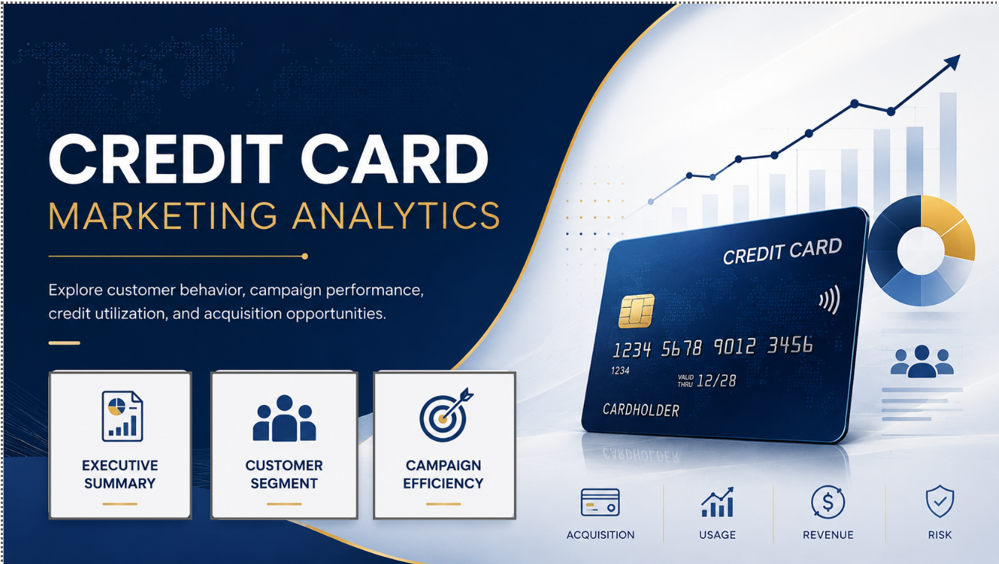
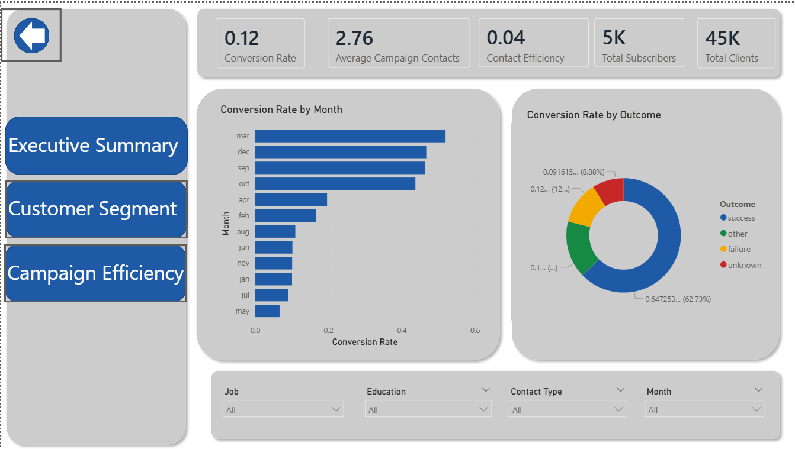
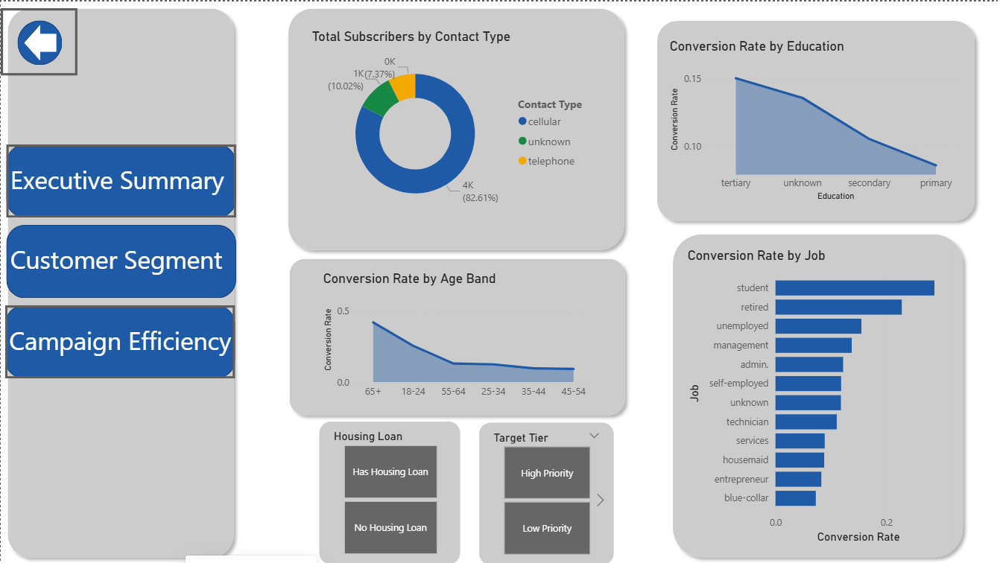
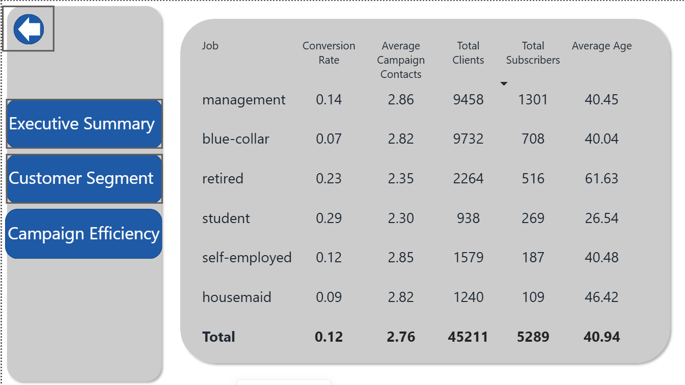

# Power BI Report Title

## Overview
This Power BI dashboard analyzes sales performance, revenue trends, customer segments, and product profitability using an anonymized dataset from the UCI Machine Learning Repository. The data itself is related to direct marketing campaigns (phone calls) of a Portuguese banking institution.

## Preview

## DatasetThis dataset contains bank client information, details about the most recent marketing contact, and previous campaign history.

The input variables include:

- `age`: Client age
- `job`: Type of job
- `marital`: Marital status
- `education`: Education level
- `default`: Whether the client has credit in default
- `balance`: Average yearly balance in euros
- `housing`: Whether the client has a housing loan
- `loan`: Whether the client has a personal loan
- `contact`: Contact communication type
- `day`: Last contact day of the month
- `month`: Last contact month of the year
- `duration`: Last contact duration in seconds
- `campaign`: Number of contacts made during the current campaign
- `pdays`: Number of days since the client was last contacted in a previous campaign
- `previous`: Number of contacts made before the current campaign
- `poutcome`: Outcome of the previous marketing campaign

The output variable is:

- `y`: Whether the client subscribed to a term deposit
### Additional Information

The data is related with direct marketing campaigns of a Portuguese banking institution. The marketing campaigns were based on phone calls. Often, more than one contact to the same client was required, in order to access if the product (bank term deposit) would be ('yes') or not ('no') subscribed. 

There are four datasets: 
1) bank-additional-full.csv with all examples (41188) and 20 inputs, ordered by date (from May 2008 to November 2010), very close to the data analyzed in [Moro et al., 2014]
2) bank-additional.csv with 10% of the examples (4119), randomly selected from 1), and 20 inputs.
3) bank-full.csv with all examples and 17 inputs, ordered by date (older version of this dataset with less inputs). 
4) bank.csv with 10% of the examples and 17 inputs, randomly selected from 3 (older version of this dataset with less inputs). 
The smallest datasets are provided to test more computationally demanding machine learning algorithms (e.g., SVM). 

The classification goal is to predict if the client will subscribe (yes/no) a term deposit (variable y).
## Key Insights

1. Revenue increased steadily over the selected period.
2. The highest conversion job category were Students.
3. Job category management contributed the most total conversions.
4. Customer who had Tertiary education showed the strongest growth.
5. Seasonal trends were visible during March, where the most conversions happened, while the least conversions occured in May.

## Dashboard Features

- Interactive filters and slicers
- Revenue and profit KPIs
- Regional performance breakdown
- Product category analysis
- Customer segment analysis
- Time series trend charts
- Drill through or tooltip pages

## Tools Used

- Power BI Desktop
- Power Query
- DAX
- CSV
- GitHub

## Power BI Techniques Used
- Data cleaning in Power Query
- Relationship modeling
- DAX measures
- Calculated columns
- KPI cards
- Slicers and filters
- Drill through pages
- Custom tooltips
- Conditional formatting

## How to Use This Report

1. Download the `.pbix` file from the `report/` folder.
2. Open it in Power BI Desktop.
3. If needed, update the data source path.
4. Refresh the data.
5. Explore the report pages and filters.
